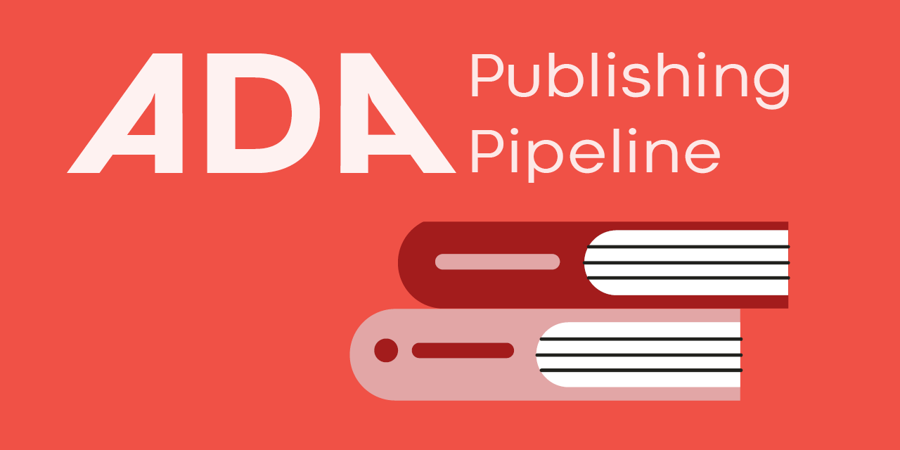

# ADA Semantic Publishing Pipeline

&mdash; Next Generation Books

An infrastructural open-source software project to support workflows for open science digital objects and improving open standards in multi-format book publishing.

(Advanced Document Architecture) 

Contact: Simon Worthington, simon.worthington@tib.eu, [@mrchristian99](https://twitter.com/mrchristian99) - ORCID https://orcid.org/0000-0002-8579-9717

Hashtags: #ADAPipeline 

## Challenges

  - [GitHub Pages Pipeline 6 Nov 2021](github-pages-pipeline.md) 

## News

  - 

## Summary

Semantic Publishing is a new open-source software research project contributing to the techstack for the creation of multi-format textbooks. A new generation of textbooks that includes modern Open Science digital objects, has semantic layers for structure and meaning, and packaging for interoperability. We are focusing on a specific book type ‘the textbook’ as an integrated part of MOOCs. The project is based at the Open Science Lab – TIB and contributes to the German consortium of the National Research Infrastructure for Culture (NFDI4Culture). 

## Roadmap

Background: The project is built on top of work already carried out at the Open Science Lab, TIB on multi-format and multi-channel book publishing, see [Advanced Documennt Architecture (ADA)](https://doi.org/10.5281/zenodo.3626810), [Rapid Health Publishing](https://github.com/TIBHannover/Rapid-Collaborative-Health-Publishing) and [TIB book sprints](https://www.tib.eu/en/research-development/knowledge-and-technology-transfer/services-and-consulting-offered-by-tib/book-sprints).

  - Start: 26 October 2020 - NFDI4Culture Internal Kickoff meeting

### Techstack  

Note: derived from public health books sprints work of the Open Science Lab, with 11 books produced with over 100 sprint participants, completed in 2020.

 1. Fidus Writer – Real-time collaborative WYSIWYG editor
 1. GitHub infrastructure – versioning, crypto IDs, API, web server, CI/CD, etc
 1. Scalable – modern cloud infrastructure from Endocode meaning instant deployment, low costs, etc
 1. Multi-format publication ready outputs (PRO) – 100% standards validation and distribution channels ready
 1. Multiverse interoperability – publications ready for use in format domains: R, RDF, XML, etc.
 1. Open Science Service Ready – publication sources on GitHub makes content ready for processing by content services (e.g., smart objects) and data science services (e.g., PiDs), with metering.
 1. Multilingual R/L, L/R translation – CI driven translation on GitLab via Crowdin or Weblate (courtesy Modern Publishing, Hamburg Open Science)
 1. Real-time validation – validate against defined targets to ensure content 100% usable, with interactive GUI - phase two Transpect pipeline feature.
 1. Service metering – provide metrics and monitoring to support a sustainable economy by providers of services and skilled labor.
 1. Interface Moodle and LMSs – enable bi-direction LMS support
 1. Metadata – extensive, publication, assets, LOD and Wikidata, social media, and usage and sharing, PIDs
 1. Contributors and roles – rewards, attribution
 1. Community publication features – enable awards, credit and acknowledgements with pathways and on-ramps to contribute
 1. Designed for next generation scholarly publishing – standards, citations, etc

#### Technology – Online Open Science Book Sprints: ADA Technology Stack

Caption - ADA – Advanced Document Architecture https://www.draw.io/?page-id=6a731a19-8d31-9384-78a2-239565b7b9f0&scale=auto#G1Wab_PZmNacR4Ql8kYLtK8qbnRnVNABas

The objective of the technology is to facilitate rapid book and online learning publishing, maintain academic high quality standards, and utilizing modern Open Science services and low-cost easy to deploy modern cloud infrastructure. We automate as many workflow parts as possible to maximise time and cost efficiency.

The book sprint technology is built from existing open-source software modules, where we maintain active research relationships with the maintainers. The system has an overall  Technology Readiness Level (TRL) of 7 (system prototype demonstration in operational environment used). The system has been used by over 100 professionals in 10 book sprints.

 1. Fidus Writer – Real-time collaborative WYSIWYG editor. Fidus Writer is an online academic word processor like Google Docs. It uses Prose Mirror for its writing interface, as technology from a Berlin startup which solved the collaborative real-time editing. It can also be used offline, synchronizing when connected again. The system can interface citation databases, produce interoperable outputs such as JATS DAR, and interface GitHub. It’s five years old and has been funded by DFG. https://www.fiduswriter.org/
 1. GitHub/Lab automation and collaboration tech stack – versioning, crypto IDs, API, web server, CI/CD, etc. GitHub and GitLab has three categories of use for the project. 1. As an interoperable source storage for publishing and which offers free web hosting and domains. 2. For Git which gives versioning and allows for a variety of back-office asynchronous collaboration. 3. Automation. The tech stack, APIs and continuous integration and continuous development (CI/CD) etc., means a wide array of tasks can be automated. 
 1. Scalable modern cloud infrastructure from Endocode AG. Endocode work as a Google Deutschland partner using open-source technologies to supply blue chip corporate clients with scaleable infrastructures, SAP, VW, etc. Endocode take our open-source modules and Containerize the components as Kubernetes clusters. They use technology such as Terraform which allows scripts or recipes to deploy a complete infrastructure in the fraction of the time and cost of normal IT provision. A benefit is system adoption by non experts on low cost infrastructure.  “ADA — Phases of Development: Proof of Concept to Community Handover – an Interoperable Framework for Microservices in Scholarly Publishing”. Zenodo, August 1, 2019 https://doi.org/10.5281/zenodo.3626810.
 1. Multi-format publication ready outputs (PRO) – 100% standards validation and distribution channels ready. Currently we employ CSS typesetting using Vivliosyle extension framework to W3C Paged Media CSS with some clever CSS from our team (https://vivliostyle.org/). Using format transformation web, Markdown and ‘computational publishing’ formats can be output. Transpect from Le-tex GmbH, one of Germany's leading XML content house is used for sharded output pipelines and validation (https://transpect.github.io/). Publication ready outputs (PRO) is a concept put in place by our research to designate publishing target outputs as being 100% validated ready to publish, e.g., be format compliant and have all aspects such as correct metadata. Many systems ‘say’ that can make an EPUB 3.0 for example but the output will not be ready for publishing so in effect not ready for distribution.
 1. Multiverse interoperability – publications ready for use in format domains: R, RDF, XML, etc. Many scholarly disciplines are tied to specific technical formats: data scientists will use R to run analysis; knowledge graph communities will use RDF, etc. Out system if format agnostic and instead we look for format capabilities and rank formats by feature lists. We look to hold master formats with as much information as possible and then transform files between formats. A main tool for this is Transpect, as well as others, but it can also be through frameworks like Pandoc and CI pipelines.
 1. Open Science Service Ready – publication sources on GitHub makes content ready for processing by content services (e.g., smart objects) and data science services (e.g., PiDs), with metering. The future of scholarly publishing is the ‘Computational Publication’ but moving to this new form of modular document will be a slow process. See: Research Compendium https://research-compendium.science/. To facilitate this transition we enable service access. For example in authoring or post-processing: knowledge graphs, Wikidata indexing, and data mining citable searches can be used. As well as the use of smart objects for images and diagrams: Diagram.net https://www.diagrams.net/ or European Molecular Biology Organization EMBO https://sourcedata.embo.org/ or semantic video embeds from TIB AV Portal https://av.tib.eu/.
 1. Multilingual R/L, L/R translation – CI driven translation on GitLab via Crowdin https://crowdin.com/ or Weblate https://weblate.org/en-gb/ (courtesy Modern Publishing, Hamburg Open Science: https://oa-pub.hos.tuhh.de/en/). Additionally machine and human translation can be combined using DeepL https://www.deepl.com/home. Initially the setup is used on GitLab with a Crowdin used in a CI pipeline. When new content is added users are emailed and translation updates are made through an easy to use interface. Crowdin is used as it can accomodate L/R and R/L text in the same document, this is important for example with arabic annotations on a French document.
 1. Real-time validation – validate against defined targets to ensure content 100% usable, with interactive GUI – phase two Transpect pipeline feature. We use Continuous Integration (CI) to test publication ready outputs against target outputs, and against new releases of formats. This can be done in real-time and ensures that content is always ready to be distributed and wont go out of service. Transpect is used for this process. The validation service can also ensure format compliance and give quality assurance levels when many external processes are being used. Manual and automatic fixes can be applied.  
 1. Service metering – provide metrics and monitoring to support a sustainable economy by providers of services and skilled labor. Open Science and publishing services can be metered via API calls as well as other unit measurements. Metering can be used to allow for subsiding services and auditing resources needed. Metering also allows for a sustainable economy to be put in place and for different actors to join a market place. Google Cloud Platform (GCP) and GitHub/Lab would be used initially for metering. GCP https://cloud.google.com/products/.
 1. Interface Moodle and Learning Management Systems (LMSs) – enable bi-direction LMS support. Book chapters, books and collections of books can be published directly to Moodle via its API https://docs.moodle.org/dev/Main_Page. Additionally using the API usage data and tests and other media can be associated with publications. 
 1. Metadata – extensive, publication, assets, Linked Open Data (LOD) and Wikidata, social media, and alt metrics and usage, and sharing, PIDs. Master files in Fidus Writer are already able to have tagging added making them usable in Digital Humanities and data science contexts. Document metadata is stored as Yaml files. ISBNs, DOIs and ORCID are used.
 1. Community publication features – enable awards, credit and acknowledgements with pathways and on-ramps to invite collaboration and crowdsourcing. Publications such as The Turing Way (https://the-turing-way.netlify.app/) demonstrate how a publication can be owned by a community. There are a number of layers that can be applied to making a publication increase in quality and value by supporting collaboration. First we use Hypothesis for commenting (https://web.hypothes.is/). Then these are the group working functions of GitHub/Lab. Most important are the social aspects which means strategizing ways of involvement for a community, see interview in GenR with director of research Juan Pablo Alperin of Open Journal Systems and PKP (https://genr.eu/wp/open-source-innovating-publishing-pkps-open-preprint-systems/). Attribution and rewards are important here and we would use CRediT – Contributor Roles Taxonomy as a basis for capturing this information https://casrai.org/credit/.

#### Schematic - book part / Moodle part to follow

#### Simple workflow

Diagram.net schematic https://drive.google.com/file/d/1-P65cgrcGabE_1Hdoo-P9ya20sPaUuLe/view?usp=sharing

## Roadmap
 
- Emergency Book bookstrap (triage), 8+ books - https://akademie-oeffentliches-gesundheitswesen.github.io/lehrbuch-krisenmanagment/
  - [eBook pipeline](ebook-pineline.md)
- Metadata consultation TIB - bootstrap metadata across multiformat books, book trade and scholarly, library and OER, + usage metrics
- Fidus to GitHub - https://github.com/fiduswriter/fiduswriter-github-export
- Templating work for Fidus to GitHub - In-progress
- Fidus UI 
- Template consultation from Vivliostyle, Le-tex, and Avco on Jekyll - In-progress
- Pipeline consultation with Le-tex
  - Flight checker
   - Publication Ready Outputs (PRO) validation
- Avco/Interpunct on designing a Bootstrap for multiformat
- Metadata consultation TIB - crypto IDs, OSL/TIB (review round 1 and incorporate blockchain)
- System review - post Book triage
- Moodle OER pipeline
- Sysadmin server due to rapid development  
- Pandoc in browser
- Pandoc-scholar and GitLab CI - Connect to Modern Publishing, Hamburg Open Science (HOS) - https://oa-pub.hos.tuhh.de/en/
- ADA - Microservice / cloud / CD-CI / API Endocode - connects us to the world
- Endocode cloud build with Fidus Writer
- Validator CI for publishing / OER
- Editorial, proofing, markup - workflow and pipeline
- RINSE REPEAT!!!

### Later stage

 - Connect ORKG, Markus Stocker semantic authoring pipelines

## Architecture - Advanced Document Architecture (ADA)

Simon Worthington, Lisa Nöth, and Johannes Amorosa, ‘ADA — Phases of Development: Proof of Concept to Community Handover  – an Interoperable Framework for Microservices in Scholarly Publishing’, 1 August 2019, https://doi.org/10.5281/zenodo.3626810.

## Releases, publications and blogosts

### Blogposts and history

  - Worthington, Simon. 2020. ‘Semantic Publishing: The Future Open Textbook – a Contribution to NFDI4Culture’. TIB-Blog (blog). 10 November 2020. https://blogs.tib.eu/wp/tib/2020/11/10/semantic-publishing-the-future-open-textbook-a-contribution-to-nfdi4culture/.

#### History

The research came out of work done over 2020 on Rapid Publishing in Public Health training related to the COVID pandemic when TIB's book sprint research had to be deployed at speed - nine books were produced over 2020 with over 100 medical professionals taking part. See: https://github.com/TIBHannover/Rapid-Collaborative-Health-Publishing

## Contributors and credits

### People

Lead - Simon Worthington

TIB - Open Science Lab (OSL), NFDI4Culture team: Lambert Heller (OSL Team Lead), Ina Blümel (OSL Co-team Lead) and, Lucia Sohmen.

## About NFDI4Culture

The Consortium for Research Data on Material and Immaterial Cultural Heritage (NFDI4Culture)

The aim of NFDI4Culture is to establish a demand-oriented infrastructure for research data on material and immaterial cultural assets. This includes 2D digitised reproductions of paintings, photographs and drawings as well as 3D digital models of culturally and historically important buildings, monuments or audiovisual data of music, film and stage performances. Concept and structure of the consortium were developed over two years in an open process and in close cooperation between 11 professional societies, 9 supporting institutions and 52 partners. The consortium addresses the needs of a broad spectrum of disciplines from architecture, art, music, theatre, dance, film and media studies.

https://www.nfdi4culture.de 

https://twitter.com/nfdi4culture 

## Copyright and licencing

Content - © 2020-21 The authors. Creative Commons Attribution-ShareAlike 4.0 [https://creativecommons.org/licenses/by-sa/4.0/](https://creativecommons.org/licenses/by-sa/4.0/)

Code - Semantic Publishing, © 2020 The authors. GNU General Public License v3.0 https://github.com/TIBHannover/ADA_infra/blob/master/LICENSE | Source https://github.com/TIBHannover/semantic-publishing

Data - All data and data sets produced would be CC 0, Public Domain, https://creativecommons.org/publicdomain/zero/1.0/

All fonts and graphics and media production software used on the production would be OSI compliant.

FAIR principles would also be applied https://www.go-fair.org/fair-principles/

All third party content and code is the copyright of the authors and under their respective OSI compliant open licenses for code and compliant with Creative Commons Attribution-ShareAlike 4.0 International for content.
